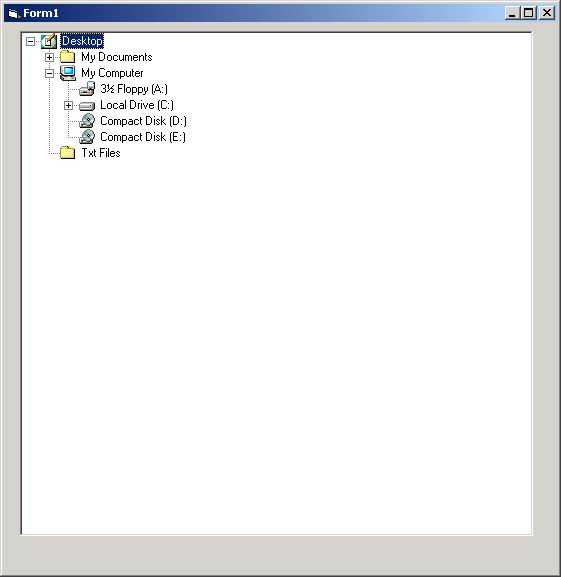



## Directory Folder

### Description

Directory Tree View. This is an activeX control which which looks like windows explore Folder view. This is to display on you drives in a tree control and and desktop, plus my documents and much more.
 
### More Info
 

             |
---                |---
**Submitted On**   |2002-03-04 22:04:10
**By**             |[Pawel Pastuszak](https://github.com/Planet-Source-Code/PSCIndex/blob/master/ByAuthor/pawel-pastuszak.md)
**Level**          |Intermediate
**User Rating**    |4.5 (18 globes from 4 users)
**Compatibility**  |VB 6\.0
**Category**       |[Files/ File Controls/ Input/ Output](https://github.com/Planet-Source-Code/PSCIndex/blob/master/ByCategory/files-file-controls-input-output__1-3.md)
**World**          |[Visual Basic](https://github.com/Planet-Source-Code/PSCIndex/blob/master/ByWorld/visual-basic.md)
**Archive File**   |[Directory\_59359342002\.zip](https://github.com/Planet-Source-Code/pawel-pastuszak-directory-folder__1-32352/archive/master.zip)

